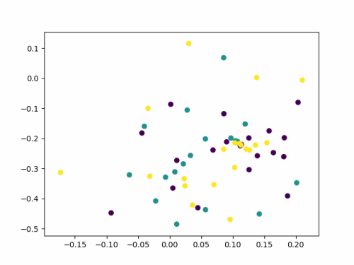
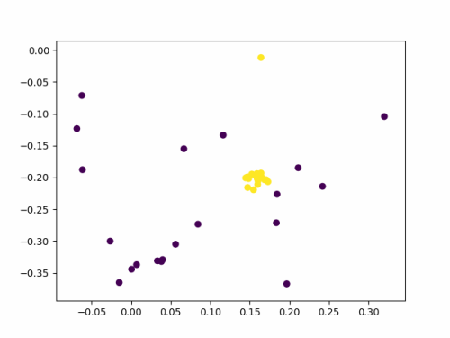

# FFSTP-Feature-Fusion-Spatial-Transformer-Prototypical-Networks
sample code for 'FFSTP: Feature Fusion Spatial Transformer Prototypical Networks'

This is a simple training demo for Feature Fusion Spatial Transformer Prototypical Networks.
(2021.5.26:*Update)

Run train.py to test model training.

Visualization examples will be updated within a week

-------

Authors
-------

- @Kangying Li 

License
